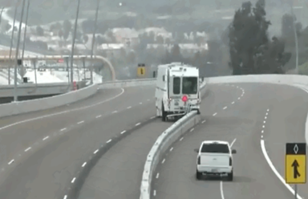
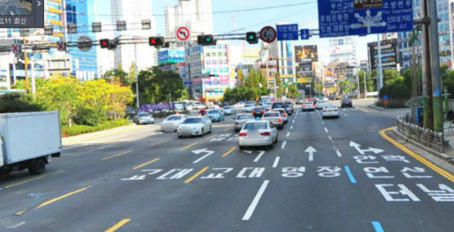

----------
##**7조. 러시아워 방지 차선변경 시스템**

- 팀원 
	-  김영호
	- 정우진
	- 조준환
	- 차재영

----------

 - ###**목차**

 ####1. **필요성**
 ####2. **시스템 개요**
 ####3. **기존관련 사례**

 

----------
#####**1.필요성**
전 세계 많은 도시에서 *출퇴근 교통 혼잡을 해소하기 위한 여러 정책*과 제도를 시행하고 있다. 국내의 경우 수도권 지역의 밀집된 인구와 일부 운전자의 잘못된 운전 습관, 교통사고나 진입구간의 병목현상 등의 이유로 심각한 교통체증을 앓고 있다. 특히 출퇴근 시간에 발생하는 ‘러시아워’는 매우 심각하여 많은 시민들이 불편함을 겪고 있다. 이에 정부는 차량10부제, 대중교통 이용하기, 자전거 타기, 버스전용차로제 등 많은 제도를 시행하고 있다. 우리는 이 중 *‘가변차로제’라는 제도를 이용하여 보다 실용적인 시스템을 개발*하고자 한다.

#####**2.시스템 개요**
- 운전자들이 차선 변경 여부를 확실하게 인지하여야 한다.

- 차선이 변경됨으로 인해 사고를 유발하지 않아야 한다.
> 해결방안 : 차선이 변경되는 대상은 반대편 차선의 1차선이므로 그 차선에 있는 차량의 이동이 필요하다. 따라서 가변차로 전용 신호등을 설치하여 해당 차선에 머물던 차량을 먼저 통행시킨다.
 
- 도로의 교통량을 파악하여 그에 맞춰 시스템이 동작하여야        한다.
> 해결방안 : 가변차로 시스템을 도입할 수 있는 상황인지를 체크하기 위하여 차량 통행 속도, 통행량, 평균시간을 적용할 수 있는 알고리즘을 구상한다.

- 비상시 가변차로를 확보할 수 있도록 개발되어야 한다.
> 해결방안 : 관제시스템을 도입하여 구급차, 소방차, 경찰차에서 관제실로 연락을 할 시에 차선을 빨간색으로 변경하여 긴급 상황에 대처할 수 있도록 한다. 이 때, 빨간색으로 변경되는 차선은 통행량이 적은 차선을 기준으로 한다.

- 가변차로는 자동 또는 원격으로 동작하여야 한다.
> 해결방안 : 평시에는 적용된 알고리즘을 통하여 시스템이 동작하도록 하며, 비상시 또는 고장 시에는 관제실에서 원격으로 시스템을 동작시켜 최소 비용으로 최대의 효과를 도출한다.

#####**3.기존관련 사례**

| 구분 | 이름 | 사진 | 관련 사이트 |
| ------------- |:-------------:| :-----:| :-----:|
| 국내 | 기존 가변차로제 |  | [link](https://ko.wikipedia.org/wiki/%EA%B0%80%EB%B3%80%EC%B0%A8%EB%A1%9C) |
| 국외 | 이동식 중앙분리선 |  | [link][Arbitrary case-insensitive reference text]|

[arbitrary case-insensitive reference text]:http://t-eng.tistory.com/11
